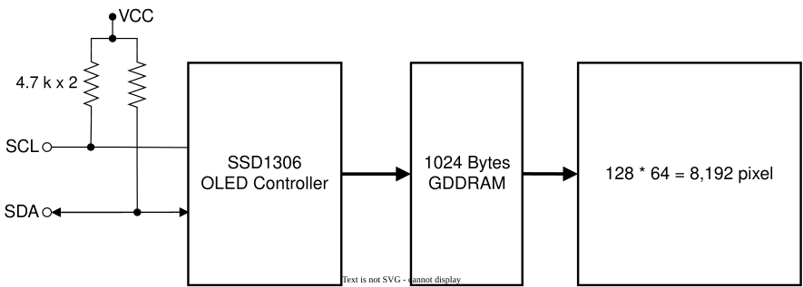

# บทเรียนที่ 9.1: สถาปัตยกรรมบัส SPI และโครงสร้างภายในคอนโทรลเลอร์ SSD1306

---

## 1. วิวัฒนาการและการเปรียบเทียบโพรโทคอลสื่อสาร (I2C vs SPI vs Shift Register)

ในการพัฒนาอุปกรณ์แสดงผลสำหรับ IoT ในระดับกายภาพนั้น การเลือกบัสสื่อสารระหว่างไมโครคอนโทรลเลอร์กับอุปกรณ์รอบข้าง (Peripherals) มีผลโดยตรงต่อความเร็วในการรีเฟรชหน้าจอ (Frame Rate) และความซับซ้อนของการเขียนเฟิร์มแวร์ โดยทั่วไปจะมีอินเทอร์เฟซให้ใช้ 2 แบบ คือ I2C และ SPI

### 1.1 การอินเทอร์เฟซแบบ I2C (Inter-Integrated Circuit) 
การอินเตอร์เฟสแบบ I2C ใช้สายสัญญาณ 2 เส้น คือ SDA และ SCL โดย SDA ใช้สำหรับส่งข้อมูล และ SCL ใช้สำหรับส่งสัญญาณนาฬิกา มีข้อดีคือใช้สายสัญญาณน้อยแต่ข้อเสียคือความเร็วในการส่งข้อมูลช้ากว่า SPI



### 1.2 การอินเทอร์เฟสแบบ 4-Wire SPI (Serial Peripheral Interface)

การอินเตอร์เฟสแบบ SPI ใช้สายสัญญาณ 4 เส้น คือ MOSI, SCK, CS, DC และ RES โดย MOSI ใช้สำหรับส่งข้อมูล และ SCK ใช้สำหรับส่งสัญญาณนาฬิกา มีข้อดีคือความเร็วในการส่งข้อมูลเร็วกว่า I2C ทำให้มีอัตราการรีเฟรชหน้าจอ (Frame Rate) ที่สูงกว่า 


### ตารางเปรียบเทียบคุณสมบัติ

| คุณลักษณะ |  I2C (SSD1306 4-pin) | 4-Wire SPI (SSD1306 7-pin) |
| :--- | :--- | :--- |
| **จำนวนสายสัญญาณ** |  2 สาย (SDA, SCL) | 4-5 สาย (MOSI, SCK, CS, DC, RES) |
| **ความเร็วในการส่งข้อมูล** | ช้า-ปานกลาง (100 kHz - 400 kHz) | **เร็วมาก (10 MHz - 20 MHz+)** |
| **อัตราการรีเฟรชหน้าจอ (FPS)** | 10 - 15 FPS (ค่อนข้างกระตุก) | **50 - 60+ FPS (ลื่นไหล เหมาะกับ Realtime UI)** |

ในการทดลองที่ผ่านมา เรามีการสุ่มสัญญาณจาก Potentiometer และแสดงผลผ่าน kestrel ที่อัตรา 10 - 20 ครั้งต่อวินาที ซึ่งจะกระตุกถ้าต่อกับหน้าจอ OLED แบบ I2C ทั่วไป ดังนั้นในการทดลองนี้เราจะใช้ OLED ที่มีอินเตอร์เฟสแบบ 4-Wire SPI เพื่อให้ได้อัตราการรีเฟรชหน้าจอที่สูงพอที่จะแสดงผลกราฟิกแบบ Realtime UI สำหรับอัตราการสุ่มนั้นได้ โดยไม่ต้องเขียนโปรแกรมเพิ่มสำหรับการปรับความสัมพันธ์ของเฟรมเรตและอัตราการสุ่มข้อมูลให้แสดงผลแบบต่อเนื่อง

---

## 2. โครงสร้างฮาร์ดแวร์ 4-Wire SPI บนโมดูล OLED SSD1306

โมดูล OLED 0.96 นิ้วที่มีแถบขาเชื่อมต่อ 7 ขา ใช้มาตรฐานการเชื่อมต่อแบบ **4-Wire Serial Peripheral Interface (SPI)** โดยขาแต่ละขามีบทบาทเฉพาะเจาะจง ดังนี้


```
                  +-----------------------------------+
                  |      SSD1306 OLED Controller      |
                  |                                   |
ESP32 GPIO 18 ───►│ D0 (SCK)   : สัญญาณนาฬิกา Master │
ESP32 GPIO 23 ───►│ D1 (MOSI)  : สายส่งข้อมูลพิกเซล/คำสั่ง│
ESP32 GPIO 5  ───►│ CS (CS#)   : เลือกว่าจะคุยกับชิปนี้ (0=Active)
ESP32 GPIO 2  ───►│ DC (D/C#)  : จำแนกว่า Byte นี้คืออะไร (0=Cmd, 1=Data)
ESP32 GPIO 4  ───►│ RES (RES#) : ขารีเซ็ตวงจรฮาร์ดแวร์ (0=Reset)
                  +-----------------------------------+
```

### หน้าที่ของขา DC (Data / Command Select)
หัวใจสำคัญที่สุดที่ทำให้นักศึกษาเข้าใจสถาปัตยกรรมของคอนโทรลเลอร์หน้าจอ คือขา **DC**:
- **เมื่อ DC = 0 (LOW):** ชิปจะตีความไบต์ที่ส่งเข้าไปว่าเป็น **"Command Register"** เช่น การตั้งค่าคอนทราสต์, การเปิด Charge Pump, หรือการกำหนดตำแหน่งเคอร์เซอร์
- **เมื่อ DC = 1 (HIGH):** ชิปจะตีความไบต์ที่ส่งเข้าไปว่าเป็น **"Graphic Data (พิกเซล)"** และจะนำข้อมูลนั้นเขียนลงในหน่วยความจำ GDDRAM ทันที

---

## 3. สถาปัตยกรรมหน่วยความจำกราฟิก 1 KByte (GDDRAM Architecture)

หน้าจอขนาด 0.96 นิ้ว มีความละเอียดทางกายภาพ $128 \times 64$ พิกเซล รวมทั้งสิ้น $8,192$ จุด  
เนื่องจากเป็นจอแบบขาว-ดำ (Monochrome) แต่ละจุดพิกเซลจึงต้องการข้อมูลเพียง **1 บิต** (0 = ดับ, 1 = สว่าง)

$$\text{ขนาดหน่วยความจำทั้งหมด} = \frac{128 \times 64 \text{ bits}}{8 \text{ bits/byte}} = 1,024 \text{ Bytes} = 1\text{ KByte}$$

### โครงสร้างแบ่งเป็น 8 Pages (Page 0 ถึง Page 7)
ชิป SSD1306 ไม่ได้จัดเก็บข้อมูลแบบแนวนอนเรียงกัน 128 บิต แต่จัดเก็บในลักษณะ **8 Pages ในแนวตั้ง**:

```
           Column 0   Column 1   Column 2   ...   Column 127
          ┌──────────┬──────────┬──────────┬─────┬──────────┐
Page 0    │ Byte [0] │ Byte [1] │ Byte [2] │ ... │Byte[127] │ (Row 0 - 7)
          ├──────────┼──────────┼──────────┼─────┼──────────┤
Page 1    │Byte [128]│Byte [129]│   ...    │     │Byte[255] │ (Row 8 - 15)
          ├──────────┼──────────┼──────────┼─────┼──────────┤
Page 2    │   ...    │          │          │     │          │ (Row 16 - 23)
Page 3    │   ...    │          │          │     │          │ (Row 24 - 31)
Page 4    │   ...    │          │          │     │          │ (Row 32 - 39)
Page 5    │   ...    │          │          │     │          │ (Row 40 - 47)
Page 6    │   ...    │          │          │     │          │ (Row 48 - 55)
          ├──────────┼──────────┼──────────┼─────┼──────────┤
Page 7    │Byte [896]│   ...    │          │     │Byte[1023]│ (Row 56 - 63)
          └──────────┴──────────┴──────────┴─────┴──────────┘
```

### การกระจายบิตใน 1 ไบต์ (1 Vertical Byte)
ในแต่ละ Page ทุกๆ 1 ไบต์จะคุมพิกเซลในแนวตั้ง 8 จุดเสมอ:
- บิตที่ 0 (LSB - บิตล่างสุด): ควบคุมพิกเซลด้านบนสุดของ Page
- บิตที่ 7 (MSB - บิตบนสุด): ควบคุมพิกเซลด้านล่างสุดของ Page

```
      LSB  Bit 0 ───► [Pixel Y = 0]
           Bit 1 ───► [Pixel Y = 1]
           Bit 2 ───► [Pixel Y = 2]
           Bit 3 ───► [Pixel Y = 3]
           Bit 4 ───► [Pixel Y = 4]
           Bit 5 ───► [Pixel Y = 5]
           Bit 6 ───► [Pixel Y = 6]
      MSB  Bit 7 ───► [Pixel Y = 7]
```

---

## 4. คณิตศาสตร์ Bitwise Manipulation บน Framebuffer ในแรมของ ESP32

ในการวาดภาพลงบนจอ เราจะไม่ส่งข้อมูลพิกเซลทีละจุดออกไปทางสาย SPI ให้เปลืองเวลา Overhead แต่เราจะสร้าง **Framebuffer ขนาด 1,024 ไบต์ขึ้นมาในแรมของ ESP32 ก่อน**:

```c
uint8_t oled_buffer[1024]; // หน่วยความจำจำลองขนาด 1KB บนแรมของ ESP32
```

เมื่อเราต้องการจุดไฟพิกเซลที่พิกัด $(x, y)$ ใดๆ:
1. คำนวณหาว่าพิกัดนั้นตกอยู่ใน Page ใด: $\text{Page Index} = \lfloor y / 8 \rfloor$
2. คำนวณหาตำแหน่ง Offset ไบต์ในอาร์เรย์: $\text{Index} = x + (\text{Page Index} \times 128)$
3. คำนวณหาตำแหน่งบิตภายในไบต์นั้น: $\text{Bit Position} = y \pmod 8$
4. ใช้ตัวดำเนินการระดับบิต **Bitwise OR (`|=`)** เพื่อจุดไฟ หรือ **Bitwise AND-NOT (`&= ~`)** เพื่อดับไฟ:

```c
// ตัวอย่างฟังก์ชันจุดไฟพิกเซล
void oled_draw_pixel(int x, int y, bool color) {
    if (x < 0 || x >= 128 || y < 0 || y >= 64) return; // ป้องกันเขียนเกินขอบเขตแรม

    int byte_index = x + (y / 8) * 128;
    int bit_offset = y % 8;

    if (color) {
        oled_buffer[byte_index] |= (1 << bit_offset);  // จุดไฟ
    } else {
        oled_buffer[byte_index] &= ~(1 << bit_offset); // ดับไฟ
    }
}
```

หลังจากที่เราวาดเส้น วาดกล่อง หรือเขียนตัวอักษรลงใน `oled_buffer` จนเสร็จสิ้น เราจะเรียกคำสั่งส่งผ่านบัส SPI เพียงครั้งเดียว (**Block Transfer 1,024 Bytes**) เพื่ออัปเดตหน้าจอทั้งหมดภายในเสี้ยววินาที!
