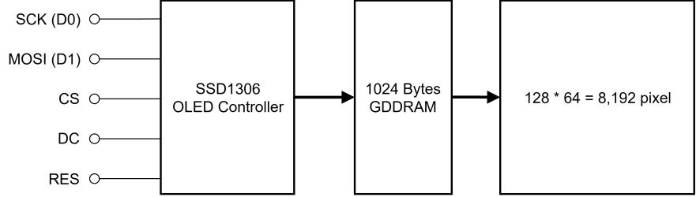
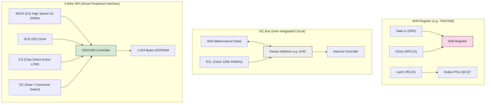

# บทเรียนที่ 9.1: สถาปัตยกรรมบัส SPI และโครงสร้างภายในคอนโทรลเลอร์ SSD1306

---

## 1. วิวัฒนาการและการเปรียบเทียบโพรโทคอลสื่อสาร (I2C vs SPI vs Shift Register)

ในการพัฒนาอุปกรณ์ IoT ทางกายภาพ การเลือกบัสสื่อสารระหว่างไมโครคอนโทรลเลอร์กับอุปกรณ์รอบข้าง (Peripherals) มีผลโดยตรงต่อความเร็วในการรีเฟรชหน้าจอ (Frame Rate) และความซับซ้อนของการเขียนเฟิร์มแวร์



```drawio
<mxfile host="127.0.0.1">
  <diagram id="BGBp3hZUxCvP14PtjKWb" name="Page-1">
    <mxGraphModel dx="1188" dy="713" grid="1" gridSize="10" guides="1" tooltips="1" connect="1"
        arrows="1" fold="1" page="1" pageScale="1" pageWidth="850" pageHeight="1100" math="0"
        shadow="0">
      <root>
        <mxCell id="0" />
        <mxCell id="1" parent="0" />
        <mxCell id="Yf1mAE-L7jGuFOsgKsXy-1" connectable="0" parent="1" style="group;fontSize=16;"
            value="" vertex="1">
          <mxGeometry height="210" width="732.41" x="40" y="160" as="geometry" />
        </mxCell>
        <mxCell id="qZ5NcXns-wohIPKxy9bx-1" edge="1" parent="Yf1mAE-L7jGuFOsgKsXy-1"
            source="qZ5NcXns-wohIPKxy9bx-2"
            style="edgeStyle=orthogonalEdgeStyle;rounded=0;orthogonalLoop=1;jettySize=auto;html=1;exitX=1;exitY=0.5;exitDx=0;exitDy=0;entryX=0;entryY=0.5;entryDx=0;entryDy=0;strokeWidth=3;endArrow=block;endFill=1;"
            target="qZ5NcXns-wohIPKxy9bx-18">
          <mxGeometry relative="1" as="geometry" />
        </mxCell>
        <mxCell id="qZ5NcXns-wohIPKxy9bx-2" parent="Yf1mAE-L7jGuFOsgKsXy-1"
            style="whiteSpace=wrap;html=1;strokeWidth=2;fontSize=16;"
            value="&lt;div&gt;SSD1306 &lt;br&gt;OLED Controller&lt;/div&gt;" vertex="1">
          <mxGeometry height="207.4074074074074" width="142.59309734513275" x="162.03761061946904"
              as="geometry"/>
        </mxCell>
        <mxCell id="qZ5NcXns-wohIPKxy9bx-3" parent="Yf1mAE-L7jGuFOsgKsXy-1"
            style="text;html=1;whiteSpace=wrap;strokeColor=none;fillColor=none;align=right;verticalAlign=middle;rounded=0;fontSize=15;"
            value="MOSI (D1)" vertex="1">
          <mxGeometry height="38.888888888888886" width="77.77805309734514" y="42.77777777777778"
              as="geometry"/>
        </mxCell>
        <mxCell id="qZ5NcXns-wohIPKxy9bx-4" parent="Yf1mAE-L7jGuFOsgKsXy-1"
            style="text;html=1;whiteSpace=wrap;strokeColor=none;fillColor=none;align=right;verticalAlign=middle;rounded=0;fontSize=15;"
            value="SCK (D0)" vertex="1">
          <mxGeometry height="38.888888888888886" width="77.77805309734514" as="geometry" />
        </mxCell>
        <mxCell id="qZ5NcXns-wohIPKxy9bx-5" parent="Yf1mAE-L7jGuFOsgKsXy-1"
            style="text;html=1;whiteSpace=wrap;strokeColor=none;fillColor=none;align=right;verticalAlign=middle;rounded=0;fontSize=15;"
            value="CS" vertex="1">
          <mxGeometry height="38.888888888888886" width="38.88902654867257" x="38.88902654867257"
              y="85.55555555555556" as="geometry"/>
        </mxCell>
        <mxCell id="qZ5NcXns-wohIPKxy9bx-6" parent="Yf1mAE-L7jGuFOsgKsXy-1"
            style="text;html=1;whiteSpace=wrap;strokeColor=none;fillColor=none;align=right;verticalAlign=middle;rounded=0;fontSize=15;"
            value="DC" vertex="1">
          <mxGeometry height="38.888888888888886" width="38.88902654867257" x="38.88902654867257"
              y="128.33333333333334" as="geometry"/>
        </mxCell>
        <mxCell id="qZ5NcXns-wohIPKxy9bx-7" parent="Yf1mAE-L7jGuFOsgKsXy-1"
            style="text;html=1;whiteSpace=wrap;strokeColor=none;fillColor=none;align=right;verticalAlign=middle;rounded=0;fontSize=15;"
            value="RES" vertex="1">
          <mxGeometry height="38.888888888888886" width="38.88902654867257" x="38.88902654867257"
              y="171.11111111111111" as="geometry"/>
        </mxCell>
        <mxCell id="qZ5NcXns-wohIPKxy9bx-8" parent="Yf1mAE-L7jGuFOsgKsXy-1"
            style="verticalLabelPosition=bottom;shadow=0;dashed=0;align=center;html=1;verticalAlign=top;shape=mxgraph.electrical.logic_gates.inverting_contact;flipV=1;legacyAnchorPoints=0;"
            value="" vertex="1">
          <mxGeometry height="12.962962962962962" width="12.963008849557522" x="84.2595575221239"
              y="12.962962962962962" as="geometry"/>
        </mxCell>
        <mxCell id="qZ5NcXns-wohIPKxy9bx-9" parent="Yf1mAE-L7jGuFOsgKsXy-1"
            style="verticalLabelPosition=bottom;shadow=0;dashed=0;align=center;html=1;verticalAlign=top;shape=mxgraph.electrical.logic_gates.inverting_contact;flipV=1;legacyAnchorPoints=0;"
            value="" vertex="1">
          <mxGeometry height="12.962962962962962" width="12.963008849557522" x="84.2595575221239"
              y="55.74074074074074" as="geometry"/>
        </mxCell>
        <mxCell id="qZ5NcXns-wohIPKxy9bx-10" parent="Yf1mAE-L7jGuFOsgKsXy-1"
            style="verticalLabelPosition=bottom;shadow=0;dashed=0;align=center;html=1;verticalAlign=top;shape=mxgraph.electrical.logic_gates.inverting_contact;flipV=1;legacyAnchorPoints=0;"
            value="" vertex="1">
          <mxGeometry height="12.962962962962962" width="12.963008849557522" x="84.2595575221239"
              y="98.51851851851852" as="geometry"/>
        </mxCell>
        <mxCell id="qZ5NcXns-wohIPKxy9bx-11" parent="Yf1mAE-L7jGuFOsgKsXy-1"
            style="verticalLabelPosition=bottom;shadow=0;dashed=0;align=center;html=1;verticalAlign=top;shape=mxgraph.electrical.logic_gates.inverting_contact;flipV=1;legacyAnchorPoints=0;"
            value="" vertex="1">
          <mxGeometry height="12.962962962962962" width="12.963008849557522" x="84.2595575221239"
              y="141.2962962962963" as="geometry"/>
        </mxCell>
        <mxCell id="qZ5NcXns-wohIPKxy9bx-12" parent="Yf1mAE-L7jGuFOsgKsXy-1"
            style="verticalLabelPosition=bottom;shadow=0;dashed=0;align=center;html=1;verticalAlign=top;shape=mxgraph.electrical.logic_gates.inverting_contact;flipV=1;legacyAnchorPoints=0;"
            value="" vertex="1">
          <mxGeometry height="12.962962962962962" width="12.963008849557522" x="84.2595575221239"
              y="184.07407407407408" as="geometry"/>
        </mxCell>
        <mxCell id="qZ5NcXns-wohIPKxy9bx-13" edge="1" parent="Yf1mAE-L7jGuFOsgKsXy-1"
            source="qZ5NcXns-wohIPKxy9bx-8"
            style="edgeStyle=orthogonalEdgeStyle;rounded=0;orthogonalLoop=1;jettySize=auto;html=1;exitX=0.9;exitY=0.5;exitDx=0;exitDy=0;exitPerimeter=0;entryX=0;entryY=0.093;entryDx=0;entryDy=0;entryPerimeter=0;endArrow=none;endFill=0;"
            target="qZ5NcXns-wohIPKxy9bx-2">
          <mxGeometry relative="1" as="geometry" />
        </mxCell>
        <mxCell id="qZ5NcXns-wohIPKxy9bx-14" edge="1" parent="Yf1mAE-L7jGuFOsgKsXy-1"
            style="edgeStyle=orthogonalEdgeStyle;rounded=0;orthogonalLoop=1;jettySize=auto;html=1;exitX=0.9;exitY=0.5;exitDx=0;exitDy=0;exitPerimeter=0;entryX=0;entryY=0.093;entryDx=0;entryDy=0;entryPerimeter=0;endArrow=none;endFill=0;">
          <mxGeometry relative="1" as="geometry">
            <mxPoint x="95.92626548672567" y="62.22222222222222" as="sourcePoint" />
            <mxPoint x="162.03761061946904" y="62.22222222222222" as="targetPoint" />
          </mxGeometry>
        </mxCell>
        <mxCell id="qZ5NcXns-wohIPKxy9bx-15" edge="1" parent="Yf1mAE-L7jGuFOsgKsXy-1"
            style="edgeStyle=orthogonalEdgeStyle;rounded=0;orthogonalLoop=1;jettySize=auto;html=1;exitX=0.9;exitY=0.5;exitDx=0;exitDy=0;exitPerimeter=0;entryX=0;entryY=0.093;entryDx=0;entryDy=0;entryPerimeter=0;endArrow=none;endFill=0;">
          <mxGeometry relative="1" as="geometry">
            <mxPoint x="95.92626548672567" y="105" as="sourcePoint" />
            <mxPoint x="162.03761061946904" y="105" as="targetPoint" />
          </mxGeometry>
        </mxCell>
        <mxCell id="qZ5NcXns-wohIPKxy9bx-16" edge="1" parent="Yf1mAE-L7jGuFOsgKsXy-1"
            style="edgeStyle=orthogonalEdgeStyle;rounded=0;orthogonalLoop=1;jettySize=auto;html=1;exitX=0.9;exitY=0.5;exitDx=0;exitDy=0;exitPerimeter=0;entryX=0;entryY=0.093;entryDx=0;entryDy=0;entryPerimeter=0;endArrow=none;endFill=0;">
          <mxGeometry relative="1" as="geometry">
            <mxPoint x="95.92626548672567" y="147.77777777777777" as="sourcePoint" />
            <mxPoint x="162.03761061946904" y="147.77777777777777" as="targetPoint" />
          </mxGeometry>
        </mxCell>
        <mxCell id="qZ5NcXns-wohIPKxy9bx-17" edge="1" parent="Yf1mAE-L7jGuFOsgKsXy-1"
            style="edgeStyle=orthogonalEdgeStyle;rounded=0;orthogonalLoop=1;jettySize=auto;html=1;exitX=0.9;exitY=0.5;exitDx=0;exitDy=0;exitPerimeter=0;entryX=0;entryY=0.093;entryDx=0;entryDy=0;entryPerimeter=0;endArrow=none;endFill=0;">
          <mxGeometry relative="1" as="geometry">
            <mxPoint x="95.92626548672567" y="190.47777777777785" as="sourcePoint" />
            <mxPoint x="162.03761061946904" y="190.47777777777785" as="targetPoint" />
          </mxGeometry>
        </mxCell>
        <mxCell id="qZ5NcXns-wohIPKxy9bx-18" parent="Yf1mAE-L7jGuFOsgKsXy-1"
            style="whiteSpace=wrap;html=1;strokeWidth=2;fontSize=16;"
            value="&lt;div&gt;1024 Bytes &lt;br&gt;GDDRAM&lt;/div&gt;" vertex="1">
          <mxGeometry height="207.4074074074074" width="103.70407079646017" x="369.4457522123894"
              as="geometry"/>
        </mxCell>
        <mxCell id="qZ5NcXns-wohIPKxy9bx-19" parent="Yf1mAE-L7jGuFOsgKsXy-1"
            style="whiteSpace=wrap;html=1;strokeWidth=2;fontSize=16;"
            value="&lt;div&gt;&lt;span style=&quot;background-color: transparent; color: light-dark(rgb(0, 0, 0), rgb(255, 255, 255));&quot;&gt;128 * 64 =&amp;nbsp;&lt;/span&gt;&lt;span style=&quot;background-color: transparent; color: light-dark(rgb(0, 0, 0), rgb(255, 255, 255));&quot;&gt;8,192&amp;nbsp;&lt;/span&gt;&lt;span style=&quot;background-color: transparent; color: light-dark(rgb(0, 0, 0), rgb(255, 255, 255));&quot;&gt;pixel&lt;/span&gt;&lt;/div&gt;"
            vertex="1">
          <mxGeometry height="207.4074074074074" width="207.40814159292034" x="525.0018584070797"
              as="geometry"/>
        </mxCell>
        <mxCell id="qZ5NcXns-wohIPKxy9bx-20" edge="1" parent="Yf1mAE-L7jGuFOsgKsXy-1"
            style="edgeStyle=orthogonalEdgeStyle;rounded=0;orthogonalLoop=1;jettySize=auto;html=1;exitX=1;exitY=0.5;exitDx=0;exitDy=0;entryX=0;entryY=0.5;entryDx=0;entryDy=0;strokeWidth=3;endArrow=block;endFill=1;"
            target="qZ5NcXns-wohIPKxy9bx-19">
          <mxGeometry relative="1" as="geometry">
            <mxPoint x="473.1498230088496" y="103.52222222222224" as="sourcePoint" />
            <mxPoint x="537.9648672566371" y="103.52222222222224" as="targetPoint" />
          </mxGeometry>
        </mxCell>
      </root>
    </mxGraphModel>
  </diagram>
</mxfile>
```




### ตารางเปรียบเทียบคุณสมบัติ

| คุณลักษณะ | Shift Register (74HC595) | I2C (SSD1306 4-pin) | 4-Wire SPI (SSD1306 7-pin) |
| :--- | :--- | :--- | :--- |
| **จำนวนสายสัญญาณ** | 3 สาย (Data, Clock, Latch) | 2 สาย (SDA, SCL) | 4-5 สาย (MOSI, SCK, CS, DC, RES) |
| **ความเร็วในการส่งข้อมูล** | ปานกลาง (~5 MHz) | ช้า-ปานกลาง (100 kHz - 400 kHz) | **เร็วมาก (10 MHz - 20 MHz+)** |
| **การระบุตัวตน (Addressing)** | ไม่มี (ต่อพ่วงแบบ Daisy-Chain) | ใช้ Device Address (7-bit เช่น `0x3C`) | **ใช้สาย Chip Select (CS) แยกเฉพาะ** |
| **การตรวจจับอุปกรณ์ (Scan)** | ทำไม่ได้ | ทำได้โดยการวนสแกนหา ACK | **ทำไม่ได้ (Write-Only ไม่มีสาย MISO)** |
| **ความฉลาดของอุปกรณ์** | ไม่มี (เป็นเพียง Flip-Flop บันทึกสถานะ) | มี MCU คอนโทรลเลอร์ภายใน | **มี MCU คอนโทรลเลอร์ + GDDRAM ในตัว** |
| **อัตราการรีเฟรชหน้าจอ (FPS)** | ไม่เหมาะสำหรับทำจอแสดงผล | 10 - 15 FPS (ค่อนข้างกระตุก) | **50 - 60+ FPS (ลื่นไหล เหมาะกับ Realtime UI)** |

---

## 2. โครงสร้างฮาร์ดแวร์ 4-Wire SPI บนโมดูล OLED SSD1306

โมดูล OLED 0.96 นิ้วที่มีแถบขาเชื่อมต่อ 7 ขา ใช้มาตรฐานการเชื่อมต่อแบบ **4-Wire Serial Peripheral Interface (SPI)** โดยขาแต่ละขามีบทบาทเฉพาะเจาะจง ดังนี้:

```
                  +-----------------------------------+
                  |      SSD1306 OLED Controller      |
                  |                                   |
ESP32 GPIO 18 ───►│ D0 (SCK)   : สัญญาณนาฬิกา Master │
ESP32 GPIO 23 ───►│ D1 (MOSI)  : สายส่งข้อมูลพิกเซล/คำสั่ง│
ESP32 GPIO 5  ───►│ CS (CS#)   : เลือกว่าจะคุยกับชิปนี้ (0=Active)
ESP32 GPIO 2  ───►│ DC (D/C#)  : จำแนกว่า Byte นี้คืออะไร (0=Cmd, 1=Data)
ESP32 GPIO 4  ───►│ RES (RES#) : ขารีเซ็ตวงจรฮาร์ดแวร์ (0=Reset)
                  +-----------------------------------+
```

### หน้าที่ของขา DC (Data / Command Select)
หัวใจสำคัญที่สุดที่ทำให้นักศึกษาเข้าใจสถาปัตยกรรมของคอนโทรลเลอร์หน้าจอ คือขา **DC**:
- **เมื่อ DC = 0 (LOW):** ชิปจะตีความไบต์ที่ส่งเข้าไปว่าเป็น **"Command Register"** เช่น การตั้งค่าคอนทราสต์, การเปิด Charge Pump, หรือการกำหนดตำแหน่งเคอร์เซอร์
- **เมื่อ DC = 1 (HIGH):** ชิปจะตีความไบต์ที่ส่งเข้าไปว่าเป็น **"Graphic Data (พิกเซล)"** และจะนำข้อมูลนั้นเขียนลงในหน่วยความจำ GDDRAM ทันที

---

## 3. สถาปัตยกรรมหน่วยความจำกราฟิก 1 KByte (GDDRAM Architecture)

หน้าจอขนาด 0.96 นิ้ว มีความละเอียดทางกายภาพ $128 \times 64$ พิกเซล รวมทั้งสิ้น $8,192$ จุด  
เนื่องจากเป็นจอแบบขาว-ดำ (Monochrome) แต่ละจุดพิกเซลจึงต้องการข้อมูลเพียง **1 บิต** (0 = ดับ, 1 = สว่าง)

$$\text{ขนาดหน่วยความจำทั้งหมด} = \frac{128 \times 64 \text{ bits}}{8 \text{ bits/byte}} = 1,024 \text{ Bytes} = 1\text{ KByte}$$

### โครงสร้างแบ่งเป็น 8 Pages (Page 0 ถึง Page 7)
ชิป SSD1306 ไม่ได้จัดเก็บข้อมูลแบบแนวนอนเรียงกัน 128 บิต แต่จัดเก็บในลักษณะ **8 Pages ในแนวตั้ง**:

```
           Column 0   Column 1   Column 2   ...   Column 127
          ┌──────────┬──────────┬──────────┬─────┬──────────┐
Page 0    │ Byte [0] │ Byte [1] │ Byte [2] │ ... │Byte[127] │ (Row 0 - 7)
          ├──────────┼──────────┼──────────┼─────┼──────────┤
Page 1    │Byte [128]│Byte [129]│   ...    │     │Byte[255] │ (Row 8 - 15)
          ├──────────┼──────────┼──────────┼─────┼──────────┤
Page 2    │   ...    │          │          │     │          │ (Row 16 - 23)
Page 3    │   ...    │          │          │     │          │ (Row 24 - 31)
Page 4    │   ...    │          │          │     │          │ (Row 32 - 39)
Page 5    │   ...    │          │          │     │          │ (Row 40 - 47)
Page 6    │   ...    │          │          │     │          │ (Row 48 - 55)
          ├──────────┼──────────┼──────────┼─────┼──────────┤
Page 7    │Byte [896]│   ...    │          │     │Byte[1023]│ (Row 56 - 63)
          └──────────┴──────────┴──────────┴─────┴──────────┘
```

### การกระจายบิตใน 1 ไบต์ (1 Vertical Byte)
ในแต่ละ Page ทุกๆ 1 ไบต์จะคุมพิกเซลในแนวตั้ง 8 จุดเสมอ:
- บิตที่ 0 (LSB - บิตล่างสุด): ควบคุมพิกเซลด้านบนสุดของ Page
- บิตที่ 7 (MSB - บิตบนสุด): ควบคุมพิกเซลด้านล่างสุดของ Page

```
      LSB  Bit 0 ───► [Pixel Y = 0]
           Bit 1 ───► [Pixel Y = 1]
           Bit 2 ───► [Pixel Y = 2]
           Bit 3 ───► [Pixel Y = 3]
           Bit 4 ───► [Pixel Y = 4]
           Bit 5 ───► [Pixel Y = 5]
           Bit 6 ───► [Pixel Y = 6]
      MSB  Bit 7 ───► [Pixel Y = 7]
```

---

## 4. คณิตศาสตร์ Bitwise Manipulation บน Framebuffer ในแรมของ ESP32

ในการวาดภาพลงบนจอ เราจะไม่ส่งข้อมูลพิกเซลทีละจุดออกไปทางสาย SPI ให้เปลืองเวลา Overhead แต่เราจะสร้าง **Framebuffer ขนาด 1,024 ไบต์ขึ้นมาในแรมของ ESP32 ก่อน**:

```c
uint8_t oled_buffer[1024]; // หน่วยความจำจำลองขนาด 1KB บนแรมของ ESP32
```

เมื่อเราต้องการจุดไฟพิกเซลที่พิกัด $(x, y)$ ใดๆ:
1. คำนวณหาว่าพิกัดนั้นตกอยู่ใน Page ใด: $\text{Page Index} = \lfloor y / 8 \rfloor$
2. คำนวณหาตำแหน่ง Offset ไบต์ในอาร์เรย์: $\text{Index} = x + (\text{Page Index} \times 128)$
3. คำนวณหาตำแหน่งบิตภายในไบต์นั้น: $\text{Bit Position} = y \pmod 8$
4. ใช้ตัวดำเนินการระดับบิต **Bitwise OR (`|=`)** เพื่อจุดไฟ หรือ **Bitwise AND-NOT (`&= ~`)** เพื่อดับไฟ:

```c
// ตัวอย่างฟังก์ชันจุดไฟพิกเซล
void oled_draw_pixel(int x, int y, bool color) {
    if (x < 0 || x >= 128 || y < 0 || y >= 64) return; // ป้องกันเขียนเกินขอบเขตแรม

    int byte_index = x + (y / 8) * 128;
    int bit_offset = y % 8;

    if (color) {
        oled_buffer[byte_index] |= (1 << bit_offset);  // จุดไฟ
    } else {
        oled_buffer[byte_index] &= ~(1 << bit_offset); // ดับไฟ
    }
}
```

หลังจากที่เราวาดเส้น วาดกล่อง หรือเขียนตัวอักษรลงใน `oled_buffer` จนเสร็จสิ้น เราจะเรียกคำสั่งส่งผ่านบัส SPI เพียงครั้งเดียว (**Block Transfer 1,024 Bytes**) เพื่ออัปเดตหน้าจอทั้งหมดภายในเสี้ยววินาที!
