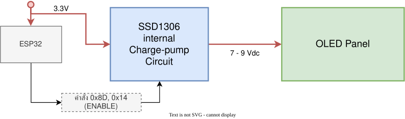

# 9.2 ชุดคำสั่งควบคุม SSD1306, วงจรทวีแรงดัน (Charge Pump) และ Addressing Modes

---

## 9.2.1 วงจรทวีแรงดันภายใน (Internal DC-DC Charge Pump) ทำไมหน้าจอถึงไม่ติด?

ปัญหาที่วิศวกรและนักศึกษาพบบ่อยที่สุดเมื่อเริ่มใช้งานจอ OLED ชิป SSD1306 คือ
> *"ต่อสายไฟ 3.3V และกราวด์ถูกต้อง แต่ทำไมหน้าจอถึงมืดสนิท ไม่มีแม้แต่แสงสลัวๆ?"*

### ฮาร์ดแวร์ของ OLED panel
เม็ดพิกเซล **Organic Light Emitting Diode (OLED)** เป็นไดโอดเปล่งแสงที่ต้องการแรงดันไบแอสตรง (Forward Bias) เพื่อขับเคลื่อนให้เกิดแสงสว่างที่ประมาณ **$7.0\text{V} - 9.0\text{V}$**  
แต่ไมโครคอนโทรลเลอร์ ESP32 จ่ายไฟออกจากพินเพียง **$3.3\text{V}$** จึงไม่สามารถทำให้ OLED สว่างได้

OLED ไม่จำเป็นต้องใช้ backlight เหมือน LED ทั่วไป แต่เปล่งแสงได้ด้วยตัวเองจึงมีข้อดีคือประหยัดพลังงานและให้ความคมชัดสูง

ผู้ผลิตชิป SSD1306 ได้ออกแบบวงจร **Switched-Capacitor Charge Pump** ไว้ภายในชิป โดยอาศัยตัวเก็บประจุภายนอก 2 ตัวบนบอร์ดโมดูลช่วยทวีแรงดันจาก 3.3V ขึ้นเป็น 7.5V โดยอัตโนมัติ 

<p align="center">
 
</p>


 ค่าเริ่มต้นจากโรงงาน (Reset Default) ของวงจร Charge Pump นี้คือ **Disabled (ปิดอยู่)**  
ดังนั้น หากเฟิร์มแวร์ไม่ได้ส่งคำสั่งเปิด Charge Pump ต่อให้สั่ง `Display ON (0xAF)` หน้าจอก็จะมืดสนิทเพราะไม่มีแรงดันไฟฟ้าไปจุดเม็ด OLED ให้สว่างนั่นเอง

---

## 9.2.2 ลำดับคำสั่งมาตรฐานในการเริ่มต้นระบบ (Magic Initialization Sequence)

เมื่อชิปได้รับสัญญาณ Hardware Reset จากขา RES เฟิร์มแวร์จะต้องส่งชุดคำสั่ง (โดยดึงขา **DC = 0**) ผ่านบัส SPI ดังนี้

| ลำดับ |    คำสั่ง (Hex)    | ความหมายทางเทคนิค                 | คำอธิบาย                                                                |
| :---: | :----------------: | :-------------------------------- | :---------------------------------------------------------------------- |
|   1   |       `0xAE`       | **Set Display OFF**               | ปิดการแสดงผลชั่วคราวเพื่อเตรียมการคอนฟิกเรจิสเตอร์                      |
|   2   |   `0xD5`, `0x80`   | **Set Display Clock Divide**      | กำหนดความถี่ Oscillator ภายในและอัตราหารสัญญาณนาฬิกา                    |
|   3   |   `0xA8`, `0x3F`   | **Set Multiplex Ratio**           | ตั้งค่าจำนวนแถวของจอ = 64 แถว (`0x3F` = 63 ในฐานสิบ)                    |
|   4   |   `0xD3`, `0x00`   | **Set Display Offset**            | กำหนดตำแหน่งเริ่มต้นของแถวแรกให้ตรงกับขอบบนสุด (Offset = 0)             |
|   5   |       `0x40`       | **Set Display Start Line**        | กำหนดให้เริ่มอ่านแรมที่บรรทัดที่ 0                                      |
|   6   | **`0x8D`, `0x14`** | **Enable Charge Pump**            | **(สำคัญที่สุด)** สั่งเปิดวงจรทวีแรงดัน 7.5V ภายในชิป                   |
|   7   |   `0x20`, `0x00`   | **Set Memory Addressing Mode**    | ตั้งค่าเป็น **Horizontal Addressing Mode** เพื่อให้เขียนข้อมูลต่อเนื่อง |
|   8   |       `0xA1`       | **Set Segment Re-map**            | แมปคอลัมน์จากซ้ายไปขวา (Col 0 ถึง Col 127)                              |
|   9   |       `0xC8`       | **Set COM Output Scan Direction** | สแกนแถวจากบนลงล่าง (COM 0 ถึง COM 63)                                   |
|  10   |   `0xDA`, `0x12`   | **Set COM Pins Hardware Config**  | กำหนดพินฮาร์ดแวร์แถวให้เหมาะสมกับขนาดจอ $128 \times 64$                 |
|  11   |   `0x81`, `0xCF`   | **Set Contrast Control**          | กำหนดความสว่างของหน้าจอ (`0x00` มืดสุด, `0xFF` สว่างสุด)                |
|  12   |   `0xD9`, `0xF1`   | **Set Pre-charge Period**         | กำหนดเวลาประจุไฟฟ้าในแต่ละพิกเซลเพื่อให้ภาพคมชัด                        |
|  13   |   `0xDB`, `0x40`   | **Set VCOMH Deselect Level**      | กำหนดระดับแรงดันอ้างอิงของสัญญาณ COM                                    |
|  14   |       `0xA4`       | **Entire Display Resume**         | นำข้อมูลจากหน่วยความจำ GDDRAM มาแสดงผลจริง                              |
|  15   |       `0xA6`       | **Set Normal Display**            | กำหนดให้บิต 1 = พิกเซลสว่าง, บิต 0 = พิกเซลดำสนิท                       |
|  16   |     **`0xAF`**     | **Set Display ON**                | **(เปิดหน้าจอทำงาน)** ปล่อยแสงสว่างจากแผง OLED                          |

---

## 9.2.3 โหมดการเข้าถึงหน่วยความจำ (Memory Addressing Modes)

SSD1306 มีโหมดการเลื่อนตำแหน่งหน่วยความจำ (Pointer Addressing) 3 รูปแบบ ดังต่อไปนี้

```
1. Page Addressing Mode (โหมดดั้งเดิม)
   เขียนครบ 128 คอลัมน์แล้ว เคอร์เซอร์จะวนอยู่ที่ Page เดิม ต้องส่งคำสั่งเปลี่ยน Page เอง

2. Horizontal Addressing Mode (โหมดที่นิยมที่สุดสำหรับ Framebuffer)
   เขียนครบ Column 127 ของ Page 0 ──► ตัวชี้จะกระโดดไป Column 0 ของ Page 1 โดยอัตโนมัติ
   เขียนครบทั้ง 8 Pages (1,024 Bytes) ──► ตัวชี้จะวนกลับมาที่ Column 0, Page 0 ทันที

3. Vertical Addressing Mode
   เขียนเลื่อนลงมาในแนวตั้งจาก Page 0 ถึง Page 7 ในคอลัมน์เดิม ก่อนจะขยับไปคอลัมน์ถัดไป
```

> **ทำไมเราจึงเลือกใช้ Horizontal Addressing Mode (`0x20, 0x00`)**  จากตารางด้านลน ในลำดับที่ 7 
> เพราะทำให้เราสามารถส่งข้อมูล Framebuffer ขนาด 1,024 ไบต์จาก ESP32 ผ่าน SPI บล็อกเดียวรวดเดียวจบ โดยไม่ต้องส่งคำสั่งสลับ Page ทุกๆ 128 ไบต์ ช่วยลดภาระของซีพียูและเพิ่มอัตรา Refresh Rate ได้อย่างมหาศาล

---

## 9.2.4 กลไกการประหยัดพลังงานและการปรับแต่ง (Display Dimming & Inversion)

คอนโทรลเลอร์ SSD1306 รองรับคำสั่งพิเศษที่สามารถนำมาทำเอฟเฟกต์บนหน้าจอ หรือลดการกินพลังงานของแบตเตอรี่ได้

1. **การปรับความสว่าง (Contrast Control)**
   - ส่งคำสั่ง `0x81` ตามด้วยค่าความสว่าง `0x00` ถึง `0xFF`
   - เหมาะสำหรับการทำโหมดหรี่แสงอัตโนมัติ (Night Mode / Auto-Dimming) เมื่อไม่มีการสัมผัสปุ่ม
1. **การกลับสีหน้าจอ (Invert Display)**
   - ส่งคำสั่ง `0xA7` (Invert Display): พื้นหลังจะกลายเป็นสีขาว ตัวหนังสือกลายเป็นสีดำ
   - ส่งคำสั่ง `0xA6` (Normal Display): กลับสู่โหมดพื้นดำตัวหนังสือขาวตามปกติ
   - นิยมใช้กระพริบเตือนเมื่อเกิดสถานะ Alarm หรือ Error ในระบบ IoT
