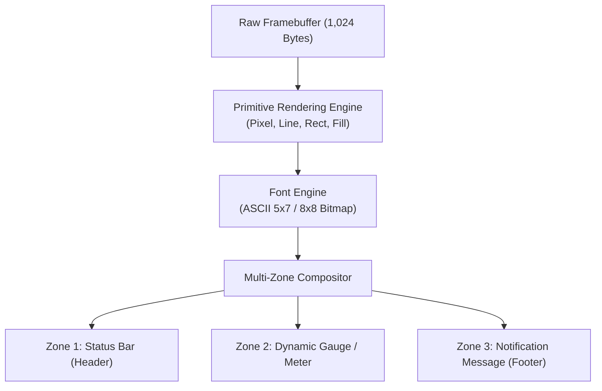

# บทเรียนที่ 9.3: กลไกการเรนเดอร์กราฟิก, บิตแมปฟอนต์ และการจัดสัดส่วน UI บนจอความละเอียดจำกัด

---

## 1. ปรัชญาการออกแบบกราฟิกบนจอความละเอียดต่ำ (Low-Resolution UI Design)

หน้าจอแสดงผล **OLED 0.96 นิ้ว** มีพิกเซลเพียง $128 \times 64$ จุด (รวม 8,192 เม็ดพิกเซล) และแสดงผลได้เพียง 1 สี (Monochrome: สว่าง หรือ ดับ)  
การออกแบบส่วนต่อประสานผู้ใช้ (User Interface: UI) บนอุปกรณ์ขนาดจำกัดเช่นนี้ จึงต้องอาศัยหลักการทางวิศวกรรมเฉพาะตัว:



1. **High Contrast & Visual Hierarchy:**
   - ใช้ความเปรียบต่างสูงสุด (ขาวตัดดำสนิท) เพื่อให้ผู้ใช้งานมองเห็นได้ชัดเจนในระยะ 1-2 เมตร
   - แบ่งพื้นที่อย่างชัดเจนด้วยเส้นแบ่งกั้น (Horizontal Dividers) ความหนา 1 พิกเซล
2. **Zero-Overhead Memory Footprint:**
   - ในระบบปฏิบัติการทั่วไป เฟรมบัฟเฟอร์แบบ 32-bit RGBA สำหรับจอ Full HD จะใช้แรมกว่า $8\text{ MB}$
   - แต่บนชิปคอนโทรลเลอร์ขนาดเล็ก สถาปัตยกรรมแบบ **1-bit per pixel** ใช้แรมของ ESP32 เพียง **1,024 ไบต์ (1 KB)** ทำให้เหลือแรมสำหรับ FreeRTOS, Wi-Fi Stack, และการประมวลผลอื่นอย่างเหลือเฟือ

---

## 2. อัลกอริทึมการวาดรูปทรงเรขาคณิตพื้นฐาน (Graphic Primitives)

ทุกองค์ประกอบบนหน้าจอ (เช่น กรอบสี่เหลี่ยม แถบความคืบหน้า เส้นกั้น) ล้วนประกอบขึ้นมาจากฟังก์ชันจุดพิกเซลพื้นฐาน `draw_pixel(x, y, color)`:

### 1) การลากเส้นตรงแนวนอนและแนวตั้ง (Fast H/V Lines)
แทนที่จะใช้สูตรคำนวณความชัน $y = mx + c$ ซึ่งกินเวลา CPU การวาดเส้นตรงในแนวราบหรือแนวดิ่งสามารถใช้การวนลูปแบบเส้นตรงได้อย่างรวดเร็ว:

```c
// การวาดเส้นแนวนอน (Horizontal Line)
void oled_draw_line_h(int x, int y, int w, bool color) {
    for (int i = 0; i < w; i++) {
        oled_draw_pixel(x + i, y, color);
    }
}
```

### 2) กรอบสี่เหลี่ยมโปร่งใส (Hollow Rectangle) และสี่เหลี่ยมทึบ (Filled Rectangle)
- **Hollow Rectangle:** ลากเส้นขอบ 4 ด้าน เพื่อใช้เป็นกรอบมาตรวัด (Gauge Border)
- **Filled Rectangle:** ถมเส้นแนวนอนเรียงซ้อนกัน เพื่อใช้เป็นแถบแสดงระดับเปอร์เซ็นต์ (Progress Fill Bar)

```
       X ──────────► X + W
    Y  ┌─────────────────┐ ◄─── Line H (ด้านบน)
       │                 │
       │  [Filled Area]  │ ◄─── เติมเต็มด้วย fill_rect ตามเปอร์เซ็นต์
       │                 │
Y + H  └─────────────────┘ ◄─── Line H (ด้านล่าง)
       ▲                 ▲
     Line V (ซ้าย)     Line V (ขวา)
```

---

## 3. สถาปัตยกรรมตารางฟอนต์บิตแมป (ASCII 5x7 Bitmap Font Matrix)

หน้าจอ OLED SSD1306 ไม่มี Font Engine หรือตัวอักษรภาษาอังกฤษในตัวเอง เฟิร์มแวร์จึงต้องบรรจุตารางเมทริกซ์จุดพิกเซลของตัวอักษรแต่ละตัวไว้ในหน่วยความจำโปรแกรม (Flash ROM)

### โครงสร้างตารางฟอนต์ 5 คอลัมน์ (5x7 Font)
ตัวอักษรแต่ละตัวจะถูกแทนที่ด้วยข้อมูลขนาด **5 ไบต์ (5 Columns)**:
- แต่ละไบต์จะควบคุมพิกเซลในแนวตั้ง 7 บิต (บิต 0 = แถวบนสุด, บิต 6 = แถวล่างสุด, บิต 7 มักเป็น 0)
- เมื่อพิมพ์ตัวอักษรเรียงกัน จะเว้นวรรค 1 พิกเซลเป็นช่องไฟ (Kerning Spacing) ทำให้ความกว้างรวมของตัวอักษร 1 ตัวคือ **6 พิกเซล**

```
ตัวอักษร 'B' (ASCII 66) = { 0x7F, 0x49, 0x49, 0x49, 0x36 }

  Col 0   Col 1   Col 2   Col 3   Col 4
  0x7F    0x49    0x49    0x49    0x36
  (127)   (73)    (73)    (73)    (54)
┌───────┬───────┬───────┬───────┬───────┐
│   ■   │   ■   │   ■   │   ■   │   .   │  Bit 0 (Row 0)
│   ■   │   .   │   .   │   .   │   ■   │  Bit 1 (Row 1)
│   ■   │   .   │   .   │   .   │   ■   │  Bit 2 (Row 2)
│   ■   │   ■   │   ■   │   ■   │   .   │  Bit 3 (Row 3)
│   ■   │   .   │   .   │   .   │   ■   │  Bit 4 (Row 4)
│   ■   │   .   │   .   │   .   │   ■   │  Bit 5 (Row 5)
│   ■   │   ■   │   ■   │   ■   │   .   │  Bit 6 (Row 6)
└───────┴───────┴───────┴───────┴───────┘
```

### การคำนวณจำนวนตัวอักษรสูงสุดต่อหนึ่งบรรทัด
$$\text{จำนวนตัวอักษรต่อบรรทัด} = \frac{128 \text{ พิกเซล}}{6 \text{ พิกเซล/ตัว}} \approx 21 \text{ ตัวอักษร}$$
$$\text{จำนวนบรรทัดสูงสุด (รวมเว้นวรรค 8 พิกเซล)} = \frac{64 \text{ พิกเซล}}{8 \text{ พิกเซล/บรรทัด}} = 8 \text{ บรรทัด}$$

---

## 4. รูปแบบการจัดสัดส่วนหน้าจอแบบหลายโซน (Multi-Zone Layout Architecture)

เพื่อรองรับการแสดงผลของระบบ IoT ขนาดใหญ่ เราแบ่งหน้าจอ 64 แถวออกเป็น **3 โซนการทำงานอิสระ**:

```
Y = 0  ┌────────────────────────────────────────────────────────┐
       │ Zone 1: Status Bar (ความสูง 14 พิกเซล)                   │
       │ - แสดงชื่อโหนด, สถานะ Wi-Fi, Uptime, Kestrel Status      │
Y = 13 ├────────────────────────────────────────────────────────┤ ◄── เส้นกั้นโซน 1
       │ Zone 2: Main Telemetry Area (ความสูง 34 พิกเซล)          │
       │ - ข้อมูลมาตรวัดสด (ADC / Speedometer / Percentage)        │
       │ - แถบความคืบหน้า (Dynamic Gauge Bar)                     │
Y = 48 ├────────────────────────────────────────────────────────┤ ◄── เส้นกั้นโซน 2
       │ Zone 3: Footer & Action Bar (ความสูง 16 พิกเซล)          │
       │ - ข้อความแจ้งเตือนจาก Web API (เช่น "CALIBRATED OK")        │
Y = 63 └────────────────────────────────────────────────────────┘
```

การแยกส่วนเช่นนี้ทำให้โค้ดฝั่ง ESP32 สามารถอัปเดตเฉพาะตัวแปรที่เปลี่ยนแปลง แล้วสั่ง `oled_flush()` ขึ้นจอได้อย่างเป็นระเบียบ ไม่ซ้อนทับกัน
