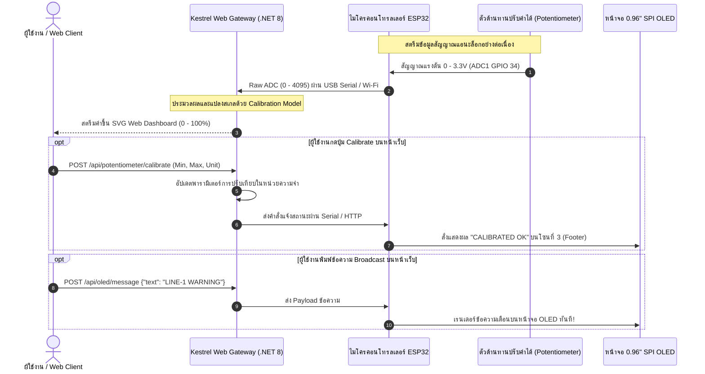

# 9.4 สถาปัตยกรรมระบบ IoT ลูปปิด (Closed-Loop Pipeline) และการปรับเทียบเซนเซอร์ (Calibration)

---

## 9.4.1 แนวคิดสถาปัตยกรรม IoT วงปิดแบบครบวงจร (Full-Duplex Closed-Loop IoT)

ในระบบ IoT ระดับอุตสาหกรรม การรับข้อมูลจากเซนเซอร์ส่งไปยังเซิร์ฟเวอร์เพียงอย่างเดียว (One-Way Telemetry) ยังไม่เพียงพอ  
ระบบที่สมบูรณ์จะต้องทำงานเป็น **Closed-Loop System** คือเมื่อเซิร์ฟเวอร์ประมวลผล ตรวจพบความผิดปกติ หรือผู้ควบคุมสั่งงานผ่านหน้าเว็บ เซิร์ฟเวอร์จะต้องสามารถ **ส่งสัญญาณหรือข้อความย้อนกลับมาสั่งการอุปกรณ์ ณ จุดติดตั้ง (Physical Edge Screen)** ได้ในทันที



---

## 9.4.2 ทฤษฎีและการสร้างแบบจำลองการปรับเทียบเซนเซอร์ (Calibration Mathematics)

### ปัญหาของเซนเซอร์แอนะล็อกและวงจร ADC
ตัวแปลงสัญญาณแอนะล็อกเป็นดิจิทัล (ADC) ของ ESP32 เป็นแบบ 12 บิต ให้ค่าตั้งแต่ $0$ ถึง $4095$  แต่ในความเป็นจริง
1. ตัวต้านทานปรับค่าได้ (Potentiometer) และสายต่อวงจรมีความต้านทานตกค้าง ทำให้จุดต่ำสุดอาจอ่านได้ $80$ ถึง $150$ แทนที่จะเป็น $0$
2. จุดสูงสุดอาจหยุดอยู่ที่ $3950$ แทนที่จะแตะ $4095$
3. ผู้ใช้งานต้องการหน่วยวัดทางกายภาพที่หลากหลาย เช่น **0 - 100 %**, **0 - 3000 RPM**, หรือ **0 - 50 °C**

### อัลกอริทึมการแปลงสเกลเชิงเส้น (Two-Point Linear Calibration)
การปรับเทียบใช้สูตรสมการเส้นตรง $y = mx + c$

$$V_{out} = \frac{ADC_{raw} - ADC_{min}}{ADC_{max} - ADC_{min}} \times (Scale_{max} - Scale_{min}) + Scale_{min}$$

*เมื่อ:*
- $ADC_{raw}$ : ค่าดิบที่อ่านได้จากฮาร์ดแวร์
- $ADC_{min}, ADC_{max}$ : ค่าจุดศูนย์และจุดสูงสุดที่ได้จากการ Calibrate
- $Scale_{min}, Scale_{max}$ : ขอบเขตค่าผลลัพธ์ที่ต้องการนำไปใช้งาน

```csharp
// ตัวอย่างโมเดลการคำนวณใน C# บน Kestrel Server
public class CalibrationService
{
    public int RawMin { get; set; } = 100;
    public int RawMax { get; set; } = 4000;
    public double ScaleMin { get; set; } = 0.0;
    public double ScaleMax { get; set; } = 100.0;
    public string Unit { get; set; } = "%";

    public double CalculateCalibratedValue(int rawAdc)
    {
        // ทำการ Clamp ค่าป้องกันค่านอกขอบเขต
        int clamped = Math.Clamp(rawAdc, RawMin, RawMax);
        return ((double)(clamped - RawMin) / (RawMax - RawMin)) * (ScaleMax - ScaleMin) + ScaleMin;
    }
}
```

---

## 9.4.3 โครงสร้าง REST Minimal API บน Kestrel Web Server

เพื่อรองรับการทำงานร่วมกันระหว่างเซิร์ฟเวอร์, ผู้ใช้งานผ่านเบราว์เซอร์, และหน้าจอ OLED ทางกายภาพ เราออกแบบ Route บน Kestrel ดังนี้

### 1) การอ่านค่าเซนเซอร์และสถานะ
* `GET /api/potentiometer/raw`
  - คืนค่าตัวเลขดิบ $0 - 4095$
* `GET /api/potentiometer/telemetry`
  - คืนค่า JSON สรุปสถานะ:
  ```json
  {
    "raw": 2048,
    "calibrated": 50.0,
    "unit": "%",
    "timestamp": "2026-09-13T16:50:00Z"
  }
  ```

### 2) การตั้งค่าการปรับเทียบ (Calibration)
* `POST /api/potentiometer/calibrate`
  - รับ Payload กำหนดขอบเขตใหม่:
  ```json
  {
    "rawMin": 120,
    "rawMax": 3980,
    "scaleMin": 0,
    "scaleMax": 100,
    "unit": "%"
  }
  ```

### 3) การสั่งการแสดงผลบนหน้าจอ OLED ทางกายภาพ
* `POST /api/oled/message`
  - ส่งข้อความจากผู้ดูแลระบบให้ไปปรากฏบน **Zone 3 (Footer)** ของหน้าจอ OLED:
  ```json
  {
    "message": "EMERGENCY STOP",
    "invert": true
  }
  ```

---

## 4. บทสรุปการผสานระบบ (End-to-End Synergy)

เมื่อนำระบบทั้ง 3 ส่วนมารวมกัน
1. **ESP32:** มีหน้าที่อ่าน ADC1 (GPIO 34), สตรีมข้อมูลขึ้นเซิร์ฟเวอร์, และวาดหน้าจอ OLED Multi-Zone ผ่าน SPI ความเร็วสูง 10 MHz
2. **Kestrel Server:** ทำหน้าที่เป็นมันสมองส่วนกลาง (Edge Compute) คอยคำนวณสเกลการ Calibrate, เสิร์ฟ Web Dashboard, และส่งคำสั่งควบคุม
3. **Web Client:** ให้ผู้ใช้งานสามารถเฝ้าระวัง ดูเกจเข็ม SVG แบบ Real-time, กดปุ่มตั้งค่า Calibrate, และส่งข้อความแจ้งเตือนย้อนกลับสู่หน้าจอจริงในห้องปฏิบัติการได้แบบ 100%
