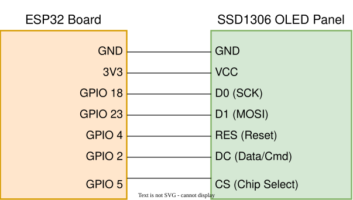

# ใบงานการทดลองที่ 9.1 (Lab 9.1)
### การประกอบสร้างตัวขับจอแสดงผล SSD1306 ทีละชิ้นส่วน (Deconstructed Bring-up) สู่ Hello World และการตรวจสอบความจำภาพเชิงนิติวิทยาศาสตร์ (Framebuffer Forensics)

>[!NOTE] **คำชี้แจง** 
>ในใบงานนี้ นักศึกษาจะได้เรียนรู้การควบคุมจอแสดงผล OLED SSD1306 แบบ 4-wire SPI 
>จากระดับพื้นฐานที่สุด โดยการ "แยกส่วนประกอบ (Deconstruct)" ระบบออกเป็นฟังก์ชันย่อย 4 ขั้นตอน 
>เพื่อให้นักศึกษาเข้าใจสถาปัตยกรรมระดับฮาร์ดแวร์อย่างถ่องแท้ แทนการคัดลอกไลบรารีสำเร็จรูป 
>พร้อมทั้งฝึกการตรวจสอบหน่วยความจำกราฟิก 1KB (**RAM & Bitwise Forensics**)

---

## 1. วัตถุประสงค์การทดลอง (Objectives)
1. เข้าใจกลไกการทำงานของสายสัญญาณ **DC (Data/Command)**, **RES (Reset)** และ **CS (Chip Select)** ในระดับฮาร์ดแวร์
2. สามารถเขียนฟังก์ชันส่งคำสั่ง (Command) และส่งข้อมูลพิกเซล (Data) ผ่านบัส SPI2 บน ESP-IDF v6.x ได้ด้วยตนเอง
3. สามารถส่งชุดคำสั่งเปิดวงจรทวีแรงดัน (**Charge Pump 0x8D, 0x14**) และคำสั่งเปิดจอ (**0xAF**) เพื่อปลุกหน้าจอให้ติดได้
4. สามารถเขียนสูตรคณิตศาสตร์ระดับบิต (**Bitwise Manipulation**) ในการแมปพิกัด $(x, y)$ ลงใน Framebuffer ขนาด 1,024 ไบต์ได้
5. สามารถนำตาราง Font Matrix 5x7 มาประกอบเป็นตัวอักษรเพื่อพิมพ์ข้อความ **"Hello World"** พร้อมรหัสนักศึกษาได้
6. สามารถทำ **Memory Forensics** ตรวจสอบไบต์และบิตในแรมของ ESP32 เพื่อพิสูจน์ความถูกต้องของภาพที่เรนเดอร์ได้

---

## 2. วงจรและการต่อสายฮาร์ดแวร์ (Schematic & Wiring)

<p align="center">

</p>


---

## 3. ขั้นตอนการทดลองแบบแยกส่วนประกอบ (Deconstructed Steps)

### กิจกรรมที่ 1.1: การสร้างท่อส่งสัญญาณระดับล่าง (Low-Level SPI & DC Toggle)

หัวใจของชิป SSD1306 อยู่ที่ขา **DC (Data/Command)**:
- ต้องการส่งคำสั่งตั้งค่าเรจิสเตอร์ $\rightarrow$ ดึงขา **`DC = 0`**
- ต้องการส่งข้อมูลพิกเซลลงแรม $\rightarrow$ ดึงขา **`DC = 1`**

ให้นักศึกษาพิจารณาและเขียนฟังก์ชันการส่งข้อมูลผ่าน SPI ดังนี้:

```c
// 1. ฟังก์ชันส่งคำสั่ง 1 ไบต์ (Command: DC = 0)
void oled_send_cmd(uint8_t cmd)
{
    gpio_set_level(OLED_PIN_DC, 0); // ดึง LOW เพื่อบอกชิปว่าเป็นคำสั่ง
    spi_transaction_t t;
    memset(&t, 0, sizeof(t));
    t.length = 8; // 8 บิต (1 ไบต์)
    t.tx_buffer = &cmd;
    spi_device_polling_transmit(s_spi_handle, &t);
}

// 2. ฟังก์ชันส่งบล็อกข้อมูลพิกเซล (Data: DC = 1)
void oled_send_data(const uint8_t *data, size_t len)
{
    if (len == 0) return;
    gpio_set_level(OLED_PIN_DC, 1); // ดึง HIGH เพื่อบอกชิปว่าเป็นข้อมูลพิกเซล
    spi_transaction_t t;
    memset(&t, 0, sizeof(t));
    t.length = len * 8; // จำนวนบิต
    t.tx_buffer = data;
    spi_device_polling_transmit(s_spi_handle, &t);
}
```

---

### กิจกรรมที่ 1.2: ปลุกจอให้ตื่นด้วย Magic Sequence (Proof-of-Life)

1. **ลำดับการ Hardware Reset (ขา RES):**
   ```c
   gpio_set_level(OLED_PIN_RES, 0); // ดึง LOW เพื่อเริ่มรีเซ็ต
   vTaskDelay(pdMS_TO_TICKS(15));
   gpio_set_level(OLED_PIN_RES, 1); // ดึง HIGH กลับพร้อมทำงาน
   vTaskDelay(pdMS_TO_TICKS(15));
   ```
2. **ส่งคำสั่งเปิดวงจรทวีแรงดัน (Charge Pump) และเปิดจอ:**
   ```c
   oled_send_cmd(0xAE); // Display OFF
   oled_send_cmd(0x8D); // Charge Pump Setting
   oled_send_cmd(0x14); // 0x14 = Enable Charge Pump (หากส่ง 0x10 จอจะดับสนิท!)
   oled_send_cmd(0x20); // Addressing Mode
   oled_send_cmd(0x00); // Horizontal Mode
   oled_send_cmd(0xAF); // Display ON!
   ```
3. **ทดสอบถมพิกเซลทั้งหน้าจอ (Test Pattern):**
   สร้างอาร์เรย์ทดสอบ 1,024 ไบต์ และส่งขึ้นจอ:
   - ส่งค่า `0xFF` ทั้งหมด $\rightarrow$ จอต้องสว่างขาวโพลนทั้งแผ่นทันที
   - ส่งค่า `0xAA` สลับ `0x55` $\rightarrow$ จอจะแสดงเป็นลายตารางหมากรุก (Checkerboard)

---

### กิจกรรมที่ 1.3: การเขียนเอนจินพิกเซลบน 1KB Framebuffer (Bitwise Canvas)

สร้างตัวแปรบัฟเฟอร์ในแรมของ ESP32:
```c
static uint8_t s_oled_buffer[1024]; // 128 คอลัมน์ x 8 เพจ = 1,024 ไบต์
```

ให้นักศึกษาเติมสูตรคณิตศาสตร์ในฟังก์ชัน `oled_draw_pixel` ด้วยตนเอง:

```c
void oled_draw_pixel(int x, int y, bool color)
{
    // ป้องกันเขียนเกินขอบเขตจอ
    if (x < 0 || x >= 128 || y < 0 || y >= 64) return;

    // คำนวณดัชนีไบต์และตำแหน่งบิต
    int byte_index = x + (y / 8) * 128;
    int bit_offset = y % 8;

    if (color) {
        s_oled_buffer[byte_index] |= (1 << bit_offset);  // Bitwise OR เพื่อเปิดไฟ
    } else {
        s_oled_buffer[byte_index] &= ~(1 << bit_offset); // Bitwise AND-NOT เพื่อดับไฟ
    }
}
```

> **แบบฝึกหัดตรวจสอบความเข้าใจ:**  
> สั่งจุดพิกเซลเดี่ยว 4 จุดที่มุมจอทั้งสี่:
> - มุมบนซ้าย: `oled_draw_pixel(0, 0, true);`
> - มุมบนขวา: `oled_draw_pixel(127, 0, true);`
> - มุมล่างซ้าย: `oled_draw_pixel(0, 63, true);`
> - มุมล่างขวา: `oled_draw_pixel(127, 63, true);`  
> เรียก `oled_flush()` แล้วใช้แว่นขยายหรือสังเกตจุดไฟทั้ง 4 มุมบนหน้าจอจริง

---

### กิจกรรมที่ 1.4: สร้างตัวอักษรและพิมพ์ "Hello World"

1. ศึกษาตารางฟอนต์ `font5x7.h` ซึ่งเก็บข้อมูล 5 ไบต์ต่อตัวอักษร
2. เขียนฟังก์ชัน `oled_draw_char` และ `oled_draw_string`:
   ```c
   void oled_draw_string(int x, int y, const char *str, bool color)
   {
       while (*str) {
           oled_draw_char(x, y, *str, color);
           x += 6; // ตัวอักษรกว้าง 5 พิกเซล + ช่องไฟ 1 พิกเซล
           if (x + 6 > 128) break;
           str++;
       }
   }
   ```
3. พิมพ์ข้อความ `"Hello World"` ที่บรรทัดแรก และพิมพ์ **"รหัสนักศึกษา"** ของตนเองที่บรรทัดถัดไป

---

## 4. ขั้นตอนการตรวจสอบเชิงนิติวิทยาศาสตร์ (Framebuffer Forensics)

ในขั้นตอนนี้ นักศึกษาจะทำหน้าที่เป็น "นักนิติวิทยาศาสตร์คอมพิวเตอร์" เพื่อตรวจสอบความถูกต้องของข้อมูลในแรม (Memory Dump) เทียบกับพิกเซลที่ปรากฏบนจอจริง

### กิจกรรมนิติวิทยาศาสตร์ 1.1: Hex Dump Memory Inspection
เขียนคำสั่ง Dump ค่าใน `s_oled_buffer` บริเวณที่พิมพ์ตัวอักษรตัวแรก (เช่น ตัว `'H'`) ออกทาง Serial Monitor:

```c
ESP_LOGI("FORENSIC", "=== DUMPING FRAMEBUFFER PAGE 0 (First 16 Bytes) ===");
for (int i = 0; i < 16; i++) {
    printf("Byte[%2d] (Col %2d): 0x%02X  [Binary: " BYTE_TO_BINARY_PATTERN "]\n", 
           i, i, s_oled_buffer[i], BYTE_TO_BINARY(s_oled_buffer[i]));
}
```

### กิจกรรมนิติวิทยาศาสตร์ 1.2: Bit-to-Pixel Forensic Reconstruction
ให้นักศึกษานำค่า Binary ของไบต์จาก Serial Monitor มาเขียนลงในตารางรายงานผลการทดลอง:
- ถอดรหัสว่าในแต่ละคอลัมน์ บิตใดเป็น `1` บ้าง
- พิสูจน์ว่ารูปแบบของบิต `1` ตรงกับรูปร่างของตัวอักษร `'H'` บนหน้าจอ OLED จริงหรือไม่!

---

## 5. คำถามท้ายการทดลองเพื่อการประเมินผล (Review Questions)
1. จากการทำ Hex Dump ในกิจกรรมนิติวิทยาศาสตร์ จงอธิบายว่าทำไมตัวอักษร `'H'` จึงใช้ข้อมูลจำนวน 5 ไบต์ และแต่ละไบต์ทำหน้าที่ควบคุมพิกเซลในทิศทางใด?
2. หากเราสลับสายไฟระหว่างขา **D0** และ **D1** จะเกิดผลอย่างไรกับสัญญาณ SPI และหน้าจอจะติดหรือไม่?
3. เหตุใดการแก้ไขพิกัด $(x, y)$ บน `s_oled_buffer` จึงไม่ทำให้ภาพบนหน้าจอจริงเปลี่ยนทันที จนกว่าจะมีการเรียกคำสั่ง `oled_flush()`?
